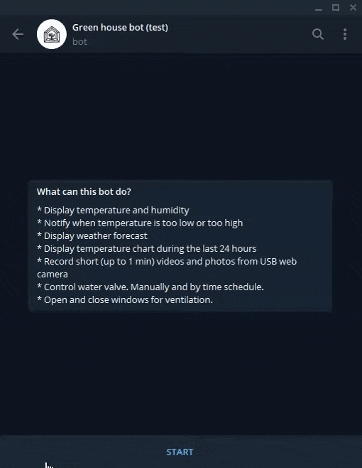

# telegram-green-house
[Russian version](README.md)

Open-source telegram bot developed for green house.

## Features:

* Display temperature and humidity
* Notify when temperature is too low or too high
* Display weather forecast
* Display temperature chart during the last 24 hours
* Record short (up to 1 min) videos and photos from USB web camera
* Control water valve. Manually and by time schedule.
* Open and close windows for ventilation. [Testing video](https://www.youtube.com/watch?v=PRlwCotQRos)

## Contacts

If you have any questions, please contact [me in telegram](https://t.me/ivan_sabelnikov)