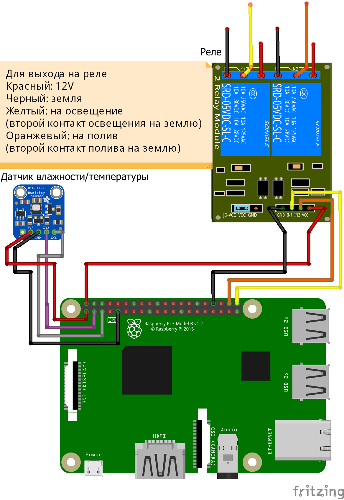

# Установка telegram-green-house

## Схема подключения



## Установка бота на Raspberry

### Требования
* Базовые навыки работы с коммандной строкой в Linux-системах.
* Наличие персонального компьютера или ноутбука (далее по тексту ПК) с ридером для SD-карт.
* Наличие WiFi-роутера, к которому есть доступ в панель управления.
* Доступ к интернету.

### Шаг 1. Установка операционной системы Raspbian
1. Скачиваем на свой ПК образ операционной системы для Raspberry [RASPBIAN STRETCH LITE](https://www.raspberrypi.org/downloads/raspbian/). Не полную, а именно LITE версию. На момент написания инструкций версия системы была `June 2018`.
2. Записываем образ на micro sd флешку. Это можно сделать при помощи утилиты [Etcher](https://etcher.io/)
   
### Шаг 2. Обеспечение доступа к Raspbian
Нужно беспечить себе доступ к Raspberry. Если есть в наличии USB-клавиатура и HDMI-монитор, то вставляем все вместе с флешкой в Raspberry, подаем на нее питание и работаем, как на обычном компьютере (по умолчанию юзер `pi`, пароль `raspberry`). В моем же случае была только Raspberry и домашний WiFi-роутер. С этом случае нужно:

1. Отредактировать на флешке файл `/etc/wpa_supplicant/wpa_supplicant.conf`, чтобы Rasbperry автоматически при старте подключилась к WiFi. Если у Вас ПК на Windows, то просто так не получится отредактировать флешку (только boot раздел), потому что там другая фаловая система и Windows ее не видит. Исправить это поможет утилита [Ext2FSD](http://www.ext2fsd.com/?page_id=16). После установки Windows увидит флешку. Открываем `/etc/wpa_supplicant/wpa_supplicant.conf` и пишем туда и сохраняем:<br />
    ```
    ctrl_interface=/run/wpa_supplicant
    update_config=1
    network={
        ssid="МояДомашняяСеть"
        psk="СуперПарольОтСети"
    }
    ```
2. Нужно настроить ssh для удаленного доступа к Raspberry. Есть в Raspbian простой способ. В boot разделе (который намного меньше по размеру и виден для Windows сразу, без установки Ext2FSD) создаем пустой файл `ssh` без расширений типа  ~~`ssh.txt`~~. Если Raspbian при загрузке видит этот файл, то активирует ssh. [Источник](https://www.raspberrypi.org/forums/viewtopic.php?t=169905)
3. Вставляем флешку в Raspberry и запускаем ее.
4. Теперь на ПК нужно установить клиент для ssh. Например, [MobaXterm](https://mobaxterm.mobatek.net/download.html). Бесплатной версии вполне хватит.
5. Если все прошло успешно, то в панели администрирования в WiFi-роутере должна появиться `raspberrypi`. Нужно узнать, какой у нее IP-адрес. Обычно в роутерах эта информация находится во вкладке DHCP.
6. Создаем SSH-сессию в MobaXterm. Если все правильно сконфигурировано, то консоль предложит ввести логин/пароль. По умолчанию юзер `pi`, пароль `raspberry`.
7. После входа **обязательно** меняем стандартный пароль командой `sudo passwd pi`. Иначе Вас легко взломают. Если сложно придумать хороший пароль, то его всегда можно [сгенерировать](https://passwordsgenerator.net/ru/)

### Шаг 3. Установка библиотек для работы бота
1. Переходим в домашний каталог и там создаем директорию для будущего бота
    ```
        cd /home/pi/
        mkdir green-house
        cd green-house
    ```
2. В директории для бота создаем временную папку для установки библиотек и переходим в пользователя root
    ```
        mkdir install
        cd install
        sudo su
    ```
3. Устанавливаем NodeJS (среда для выполнения кода JavaScript). Устанавливаем именно **8.х**, не 10.х. Новая версия NodeJS пока что несовместима с библиотеками для работы с I2C (датчик влажности/температуры).
    ```
    curl -sL https://deb.nodesource.com/setup_8.x | sudo -E bash -
    apt-get install -y nodejs
    ```
4.  Устанавливаем PM2 (менеджер процессов)
    ```
    npm i pm2 -g
    ```
5.  Устанавливаем BCM2835 (библиотека для работы с пинами GPIO)
    ```
    wget http://www.airspayce.com/mikem/bcm2835/bcm2835-1.50.tar.gz;
    tar xvfz bcm2835-1.50.tar.gz;
    cd bcm2835-1.50;
    ./configure;
    make;
    make install
    ```
    [Источник](https://gist.github.com/annem/3183536)
6. Активируем интерфейс I2C (для коммуникации с датчиком температуры/влажности)
    ```
    raspi-config
    ```
   В меню переходим: `Interfacing options => Advanced options => I2C => Yes => Yes => Finish`<br />
   [Источник](https://learn.adafruit.com/adafruits-raspberry-pi-lesson-4-gpio-setup/configuring-i2c)
7.  Устанавливаем PhantomJS (библиотека для рендеринга веб-страниц. Нужна для графиков температуры и прогноза погоды)
    ```
    wget https://github.com/fg2it/phantomjs-on-raspberry/releases/download/v2.1.1-wheezy-jessie-armv6/phantomjs_2.1.1_armhf.deb
    dpkg -i phantomjs_2.1.1_armhf.deb
    apt --fix-broken install
    dpkg -i phantomjs_2.1.1_armhf.deb
    ```
    [Источник](https://github.com/fg2it/phantomjs-on-raspberry)
8.  Устанавливаем MongoDB (база данных для сохранения показаний датчиков)
    ```
    apt-get install -y mongodb
    ```
9. Устанавливаем git (для скачивания файлов бота из репозитория)
    ```
    apt-get install -y git
    ```
10. Удаляем временную папку `install`
    ```
    cd /home/pi/green-house
    rm -R install
    ```
11. Перезагружаем Raspberry 
    ```
    reboot
    ```

### Шаг 4. Установка бота
1. Переходим в каталог для бота
   ```
   cd /home/pi/green-house
   ```
2. Скачиваем сборку бота из репозитория
    ```
    git clone --depth=1 https://github.com/vavsab/telegram-green-house-build
    ```
3. Устанавливаем NodeJS зависимости для бота 
    ```
    sudo npm install --unsafe-perm
    ```
4. Получаем токен от [@BotFather](https://t.me/BotFather).<br />
   [Источник](http://fstrk.io/blog/telegram_newbot)
5. Создаем `config.js` и заменяем в нем токен на свой. Токен находится по пути `bot.token`
    ```
    cp config.default.js config.js
    nano config.js
    ```
6. Запускаем бота и ставим его на автозапуск при старте Raspberry
   ```
   sudo pm2 start ecosystem.config.js
   sudo pm2 save
   sudo pm2 startup
   ```
7. Проверяем по логам, что бот действительно запустился
    ```
    sudo pm2 logs
    ```
8. Находим своего бота в Telegram, и проверяем, что он отвечает на сообщения.
   