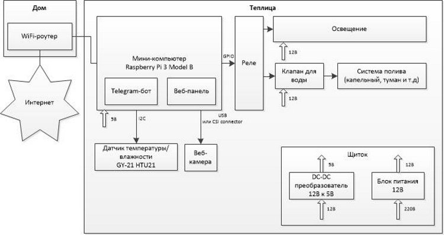

# telegram-green-house 
[English version](README.EN.md)

Открытый телеграм бот, который устанавливается в теплицу. 

## Основные функции:

* Отображение температуры и влажности
* Оповещение при превышениях температуры
* Отображение прогноза из сайта погоды (какого именно, задается в конфигурационном файле)
* Отображение графика температуры за последние сутки
* Запись коротких (до 1 мин) видео и фото из веб-камеры в теплице
* Ручное управление поливом. Управление по отрезкам времени дорабатывается.

# Демо

* [Телеграм-бот](https://t.me/demo_green_house_bot)
* [Эмулятор теплицы](http://demo.green.octopan.net:8081/) - позволяет выставить температуру/влажность и посмотреть, как на нее реагирует бот. Также здесь можно увидеть, включен или выключен свет и полив.
* [Веб-панель](http://demo.green.octopan.net:8080/) - урезанная версия бота. На данный момент только отображает температуру/влажность.

## Нюансы работы демо

* Отключена проверка прав доступа. В обычной версии нужно добавлять пользователей в конфигурационный файл, чтобы разрешить использование бота.
* Всегда отсылаются примеры фото и видео, т.к. в демо нет настоящей камеры.
* Доступен пример видео только для 5 секунд.

# Применение

Бот предназначен для установки в теплицу, которая находится в непосредственной близости от дома.

# Цена

Предупреждение:
1. Цены указаны примерно. 
2. Чтобы собрать рабочую модель, нужно обладать базовыми навыками в радиоэлектронике (например, уметь пользоваться паяльником, понимать назначение контактов на датчиках)
3. В инструкциях могут присутствовать недочеты и ошибки. Все делается на свой страх и риск.

Позиция | Цена | Комментарий | Ссылка
--- | --- | --- | ---
Raspberry Pi 3 Model B | $45 | | [Ссылка1](https://arduino.ua/prod1449-raspberry-pi-3-b) [Ссылка2](https://www.olx.ua/list/q-raspberry-pi-3-model-b/)
MicroSD карта Kingston 16GB Class 10 | $8 | Подходит и 8GB. Главное, чтобы Class 10. От флешки зависит стабильность работы Raspberry. Не стоит на этом экономить. | [Ссылка1](https://arduino.ua/prod869-microsd-karta-silicon-power-16gb-class-10--adapter) [Ссылка2](https://elmir.ua/flash_memory_cards/memory_card_micro_sdhc_16gb_kingston_sdc10g2_16gb.html)
Блок питания для Raspberry 5В 3А | $5 | Нужно брать, если пока не планируется управлять поливом или освещением через 12B. Можно использовать имеющийся дома. Но надо смотреть, чтобы он выдавал хотя бы 2A | [Ссылка1](https://arduino.ua/prod2252-blok-pitaniya-impylsnii-5v-3a-microusb)
Комплект перемычек для макетной платы МАМА-МАМА (JUMPERS-FF) - 40шт | $2 | Для соеднения Raspberry с датчиками | [Ссылка1](http://www.kosmodrom.com.ua/el.php?name=JUMPERS-FF-200MM) [Cсылка2](https://www.banggood.com/40pcs-30cm-Female-to-Female-Color-Breadboard-Cable-Jump-Wire-Jumper-p-992836.html?rmmds=detail-top-buytogether-auto__2&cur_warehouse=CN)
Датчик влажности и температуры GY-21 HTU21 | $4 | | [Ссылка1](https://arduino.ua/prod1222-datchik-vlajnosti-i-temperatyri)
Веб-камера | $25-$70 | Опционально. Это может быть как USB, так и оригинальная камера от Raspberry. Перед покупкой USB-камеры проверьте, чтобы камера поддерживалась Raspberry. Например, [здесь](https://elinux.org/RPi_USB_Webcams) | [Raspberry-камера](https://arduino.ua/prod1386-kamera-f-5mp-s-regyliryemim-fokysom-i-nochnim-videniem) [USB-камера](https://rozetka.com.ua/logitech_webcam_c170/p159479/#tab=all)
2-х канальный модуль реле 5В 10А | $2 | Опционально. Для управления поливом и освещением. | [Ссылка1](https://arduino.ua/prod201-2h_kanalnoe_rele_5V_10A)
Магнитный электрический клапан | $7 | Опционально. Для управления поливом. Подбирайте диаметр под свои трубы. Мне подошло 1/2 дюйма. | [Ссылка1](https://arduino.ua/prod369-magnitnii-elektricheskii-klapan-12-duima-zakritii-ot-elecrow)
Блок питания импульсный 12В 200Вт | $11 | Опционально. Для управления освещением, поливом, окнами. Нужно подбирать мощность в зависимости от своих потребностей. | [Ссылка1](https://arduino.ua/prod2408-blok-pitaniya-12v-200vt-16a)
DC-DC понижающий конвертер LM2596 | $2 | Опционально. Для пребразования с 12В на 5В для питания Raspberry | [Ссылка1](https://arduino.ua/prod650-DC-DC-ponijaushhii-konverter-c-4-5-60V-do-3-35V)

# Установка

[Здесь](README.Installation.md) находятся пошаговые инструкции для установки бота на Raspberry.

# План развития

* Добавить управление окнами. Аналогичное [этому](https://www.youtube.com/watch?v=vCNMl9ZpBRg)
* Унифицировать управление освещением, поливом и окнами.
* Сделать уcтановку через npm install.
* Дать возможность администратору разрешать и запрещать доступ другим пользователям.

# Для разработчика

[Здесь](README.Developer.md) находятся инструкции для запуска бота в режиме разработки.
