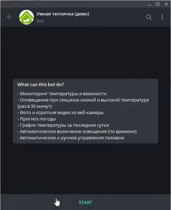

# telegram-green-house

Открытый телеграм бот, который устанавливается в теплицу. 

## Основные функции:

* Отображение температуры и влажности
* Оповещение при превышениях температуры
* Отображение прогноза из сайта погоды (какого именно, задается в конфигурационном файле)
* Отображение графика температуры за последние сутки
* Запись коротких (до 1 мин) видео и фото из веб-камеры в теплице
* Ручное управление поливом. Управление по отрезкам времени дорабатывается.

# Демо

* [Телеграм-бот](https://t.me/demo_green_house_bot)
* [Эмулятор теплицы](http://demo.green.octopan.net:8081/) - позволяет выставить температуру/влажность и посмотреть, как на нее реагирует бот. Также здесь можно увидеть, включен или выключен свет и полив.
* [Веб-панель](http://demo.green.octopan.net:8080/) - урезанная версия бота. На данный момент только отображает температуру/влажность.

## Нюансы работы демо

* Отключена проверка прав доступа. В обычной версии нужно добавлять пользователей в конфигурационный файл, чтобы разрешить использование бота.
* Всегда отсылаются примеры фото и видео, т.к. в демо нет настоящей камеры.
* Доступен пример видео только для 5 секунд.

# Архитектура

# Цена

# Установка

# Для разработчика

1. INSTALL nodemon globally:

`npm i nodemon -g`

2. Go to project folder, run PowerShell

3. Allow scripts: 
    
    Set-ExecutionPolicy RemoteSigned -Scope CurrentUser

4. Start application:

    .\start-dev.ps1

5. In another shell run:

    tsc -w

# План развития

* Добавить управление окнами. Аналогичное [этому](https://www.youtube.com/watch?v=vCNMl9ZpBRg)